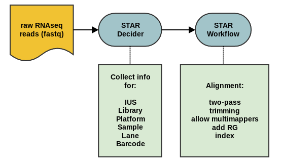

##RNASeq STAR Alignment
The STAR pipeline takes in 2 gzip-ped FASTQ files from RNAseq sources (paired sequencing), trims 
and then process them through a set of steps to map the reads to the supplied reference genome,
annotate Read Groups and index the bam file.

The pipeline implemented as a [SeqWare](http://seqware.github.io/) workflow.

##Overview of the pipeline
The below flowchart summarizes each of the components' functionality



##Compile

```
mvn clean install
```

##Usage
After compilation, [test](http://seqware.github.io/docs/3-getting-started/developer-tutorial/#testing-the-workflow), [bundle](http://seqware.github.io/docs/3-getting-started/developer-tutorial/#packaging-the-workflow-into-a-workflow-bundle) and [install](http://seqware.github.io/docs/3-getting-started/admin-tutorial/#how-to-install-a-workflow) the workflow using the techniques described in the SeqWare documentation.

###Workflow Parameters

Input/Output:
        input_file_1    string  input file with the first mate reads. Presently only one file is allowed
	input_file_2	string  input file with the second mate reads. Presently only one file is allowed
	index_dir	string  directory with STAR indexes, workflow needs it to align reads of specific length

        output_prefix   string  a root directory for outputting the results
        output_dir      string  specifies a subdirectory for outputting files
        manual_output   string  When false, a random integer will be
                                inserted into the path of the final file
                                in order to ensure uniqueness. When true,
                                the output files will be moved to the
                                location of output_prefix/output_dir
                                [false]Determines if randomly named subdir will be created in output directory tree

        queue           string  SGE cluster queue


Input/output:

    output_prefix      dir          The root output directory
    output_dir         string       The sub-directory of output_prefix where
                                    the output files will be moved
    manual_output      true|false   When false, a random integer will be
                                    inserted into the path of the final file
                                    in order to ensure uniqueness. When true,
                                    the output files will be moved to the
                                    location of output_prefix/output_dir
                                    [false]

Read Group Information (Supported so that User could override these if needed):

        rg_platform_unit    PU in Read Group annotation
        rg_library          LB in Read Group annotation	 
        rg_platform         LB in Read Group annotation	 
        rg_sample_name      LB in Read Group annotation	 
        rg_organization     Organization that performed the experiment
        sequencer_run_name  LB in Read Group annotation
        barcode	            if available, the sequence of a barcode
        lane                sequencer lane
        ius_accession	    File IUS accession

*IUS = Indivisible Sequencing Unit*

        star             path     points to STAR binary in a directory where the bundled STAR resides
        picard_dir	 dir      Directory with operation-specific jar files for picard tools
        star_aln_threads integer  Threads (Cores) requested for STAR on SGE cluster
        star-aln-mem-mb  integer  Memory (in Mb) allocated to STAR SeqWare job
        uniqMapQ         integer  Score assigned to reads aligned to a unique location (Unique mappers)
        multimap_max     integer  This is to ensure we get all multi-mappers, 
                                  may be customized to limit number of reads 
                                  mapped to multiple locations in the final bam
        sa_sparsed       integer  this is a memory-optimization parameter, we use the same as PMH folks are using
        
        additionalStarParams      If needed, user may supply additional STAR parameters

*By default, STAR assigns 255 as mapping score to such reads, this may break downstream analyses (especially with GATK) so the workflow overrides this default value assigning 60  instead
Read Group Data*


###Decider Parameters
Arguments to the decider

Input/Output:
        manual-output   Specifies how the output subtree is created (random number subdirectories created or not)
        index-dir       This should be supplied each time
        template-type   It is recommended to use WT, MR and other RNAseq template type(s)
        output-dir      subdirectory for outputting the results, will be created automatically if does not exist
        output-prefix   where do we want the results
        queue           SGE queue, normally not set but for STAR we need a queue that would be able 
                        to reserve multi-core nodes for parallel processing
        manual-output   Provision files into directory subtree with randomly named subdirectory 
                        (when set to FALSE)
        verbose         Request more to output more information when running the Decider

STAR Parameters:
        star-aln-threads      integer  Threads (Cores) allocated to STAR job
        star-aln-mem-mb       integer  Memory in Mb allocated to STAR SeqWare job
        additionalStarParams  string   User may supply additional STAR parameters

        read1-adapter-trim    string  Adapter trimming 
                                      i.e. TruSeq Universal Adapter (AGATCGGAAGAGCGGTTCAGCAGGAATGCCGAGACCG)
        read2-adapter-trim    string  Adapter trimming
                                      i.e. TruSeq Universal Adapter (AGATCGGAAGAGCGTCGTGTAGGGAAAGAGTGT)

Read Group Data:
        rg-platform-unit    PU in Read Group annotation
        rg-library          LB in Read Group annotation
        rg-platform         PL in Read Group annotation
        rg-sample-name      SM in Read Group annotation
        rg-organization     CM Organization that performed the experiment [OICR]

        outSAMattributes (may be also None or noQS but we do not need this set to any of these values)	 
        twopassMode      type of two-pass alignment [Basic]
        readFilesCommand Command for assisting with reading the input files [zcat]
        outSAMmultNmax   Defines how multimapped reads are handled
        outSAMmapqUnique STAR uses 255 mapq for uniquely mapped reads. 
                         This is not good for downstream analysis (GATK disregards reads with mapq 255) [60]
        outSAMtype       May be Unsorted, SortedByCoordinate or both (two files per alignment will be produced)

###Output files
File basename is constructed using Meta-data information obtained via Decider and includes File SeqWare ID, Donor, sequencer run, library, barcode and lane information.

 *FILE_BASENAME.Aligned.sortedByCoord.out.report.bam*
 *FILE_BASENAME.Aligned.sortedByCoord.out.report.bai*

Alignment file and it's index with Read Group information added, sorted by coordinate

###Support

For support, please file an issue on the [Github project](https://github.com/oicr-gsi) or send an email to gsi@oicr.on.ca.
